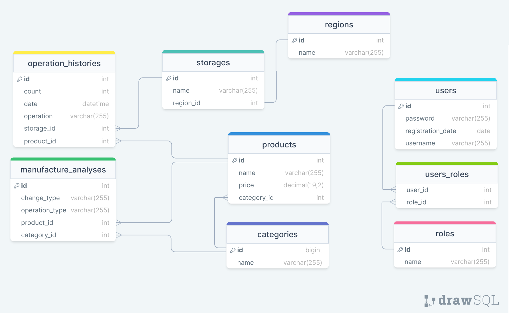

# Warehouse

Rest API для выполнения операций со складом товаров. 

### Технологический стэк:
* **Java** - основной язык программирования
* **Spring Boot (Maven project)** - базовый фреймворк для создание rest api приложения
* **Java Persistence API** - реализация ORM взаимодействия с базой данных
* **Spring Security** - настройка авторизации, аутентификации и ролей пользователей, обеспечение безопасности эндпоинтов
* **Spring Validator** - для валидации запросов пользователей
* **JWT** - настройка сессий пользователей
* **MySql** - СУБД для хранения данных приложения

* **H2** - СУБД для тестирования
* **Mockito, JUnit** - фреймворки для тестирования приложения

### Краткое описание:
Все объекты приложения: регион, склад, товар, категория, пользователь - имеют уникальные названия / имена.  
Товары могут храниться на разных складах в разных регионах.  
Каждый товар характеризуется названием, категорией, ценой.  
Товар на складе - item склада, который содержит информацию хранимого товара, его количество и информацию самого склада.  
В приложении доступно две роли пользователей: администратор и менеджер.  

Периодическое формирование отчета (запись в таблицу manufacture_analyses) о необходимости увеличения / уменьшения поставок на склад на основании нагрузки (данных таблицы operation_histories).

Доступ к приложению обеспечивается токенами доступа, которые выдаются при аутентификации пользователя. В приложении предусмотрено два токена: access и refresh. 

### Возможности администратора:
+ Получение списка всех пользователей, а также всех объектов приложения.
+ Добавление в базу данных новых товаров, складов и других компонентов приложения.  
+ Добавление и уменьшение количества товаров на складах.

### Возможности менеджера:
+ Получение списка всех товаров по категории, в диапазоне цен.
+ Определение склада по региону для погрузки / поставки.
+ Добавление и уменьшение количества товаров на складах.

### Схема базы данных
